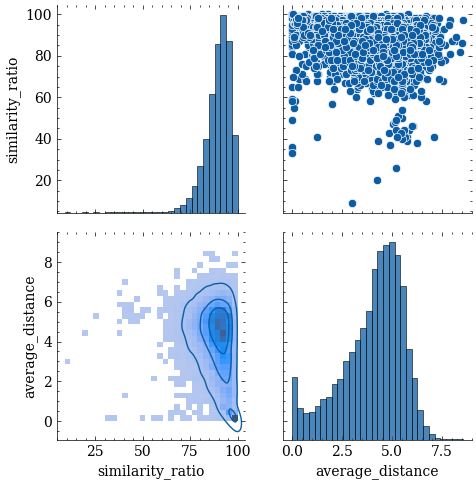

# task13

# Addendum 2022-06-02T07:18:07

Files are here: https://web.archive.org/web/20070221010838/http://www.b92.net/info/emisije/poligraf.php?yyyy=2007&mm=02&nav_id=232420 

https://web.archive.org/web/20070225180012/http://www3.b92.net/mp3/Poligraf-2007-02-13-18-55.mp3

I first converted the audio to 16kHz wav mono file. Then I tried just jamming all of the data in the model to see if it will work. It didn't:

```
RuntimeError: [enforce fail at alloc_cpu.cpp:73] . DefaultCPUAllocator: can't allocate memory: you tried to allocate 404424771136 bytes. Error code 12 (Cannot allocate memory)
```

So we shall need some splitting. But first I can try inputting just the first 20 seconds.


# Addendum 2022-06-02T11:34:08

I found that I can input 10 minutes worth of audio and the model still works. This comes at a cost: where one minute of data takes 11s to transcribe, 10 minutes takes 11 minutes, which is a whopping 18dB slower.

I still chose that option because this means we will have less aligning to do.

# Addendum 2022-06-03T12:06:33

Finally managed to run all models. The metrics are not stellar:

| model                                           |      wer |      cer |
|:------------------------------------------------|---------:|---------:|
| classla/wav2vec2-xls-r-parlaspeech-hr-lm        | 0.661052 | 0.488822 |
| classla/wav2vec2-xls-r-parlaspeech-hr           | 0.692956 | 0.459903 |
| classla/wav2vec2-large-slavic-parlaspeech-hr    | 0.801429 | 0.573916 |
| classla/wav2vec2-large-slavic-parlaspeech-hr-lm | 0.75804  | 0.616048 |

The transcript were diffed and are ready for inspection in directory [diffs](diffs).


# Addendum 2022-06-06T07:45:14

I completed the transcription of [this video](https://pescanik.net/ruske-ideje-i-srpske-replike/) as per the Skype chat  with Nikola on Friday, 12:55 PM.

| model                                           |      wer |      cer |
|:------------------------------------------------|---------:|---------:|
| classla/wav2vec2-xls-r-parlaspeech-hr-lm        | 0.582383 | 0.41452  |
| classla/wav2vec2-xls-r-parlaspeech-hr           | 0.60829  | 0.402753 |
| classla/wav2vec2-large-slavic-parlaspeech-hr-lm | 0.633161 | 0.480184 |
| classla/wav2vec2-large-slavic-parlaspeech-hr    | 0.660449 | 0.461923 |

The metrics are a bit lower, but the same ranking is seen (xls-r > large-slavic, LM helps wer but increases cer.)

# Addendum 2022-06-06T09:43:03

## Analysis of possible future data sources:

### pescanik.net

Sample size: 2

Transcripts are heavily edited. A lot of manual preprocessing would have to be done to correct them (at least as much time as the length of the audios we acquire).

We would have to download the resources manually. 

Audio: hosted on vimeo and soundcloud (difficult to scrape)

There is quite a lot of resources available though.

### Južne vesti

Sample size: 3


Transcripts slightly edited (deleted 'ot prilike', 'znate kako eerrrm', 'eto', 'i,i,i, kako bih rekao...', 'i tako dalje i tako dalje'), some bad spelling (Nišu -> Nipu, mo smo -> mi smo, diektor -> direktor), multiple speakers speaking at once in some cases .

Video hosted on yt (easier to scrape)


### B92.net

Accessed via web archive. Difficult to navigate, on the sites with transcripts there is no indication where the audio recording is. -> the searching would be difficult, but the scrapping would be the easiest yet.

Sample size: 1

Transcripts the nicest. Sometimes the speaker is interrupted and then the transcript gets cut.

Current site (not accessed through web archive) seems not to have the same file structure, nor the transcripts for the content.

# Addendum 2022-06-06T12:56:54

Next step was a sample from Južne Vesti [specifically this one](https://www.juznevesti.com/15-minuta/Marko-Nedeljkovic.sr.html):

| model                                           |      wer |      cer |
|:------------------------------------------------|---------:|---------:|
| classla/wav2vec2-xls-r-parlaspeech-hr-lm        | 0.67979  | 0.544579 |
| classla/wav2vec2-xls-r-parlaspeech-hr           | 0.701662 | 0.53524  |
| classla/wav2vec2-large-slavic-parlaspeech-hr    | 0.748031 | 0.557548 |
| classla/wav2vec2-large-slavic-parlaspeech-hr-lm | 0.715223 | 0.565849 |

# Designing the scrapper for Južne Vesti:

We need text and yt-audio. For now I assume the URL will be given as an input, if needed, we can design a crawler to get them later.

For now I will use the same [link](https://www.juznevesti.com/15-minuta/Marko-Nedeljkovic.sr.html) as above.


# Addendum 2022-06-07T09:42:58

I won't be able to download the videos here. I plan to do that on my PC where I have plenty of space and time available.

# Addendum 2022-06-08T08:01:07

The videos are now all done, except for one, which is private. I tried watching it on the website, but even there it is private. That instance has been deleted.

All in all, is quite OK. We only failed in 1/300 cases.

The scraping in the first round yielded about 15 missing videos, but when I retried it this morning, it worked OK with the same code. Perhaps YT issued some temporary block for my IP?


# Addendum 2022-06-09T12:44:55

Nikola found a recent SABOR yt video to test on. I transcribed it on all models (this is the [file](audio/s1iBR07bVrg_clipped.wav)). I do not have the transcript for it, the model transcriptions are [here](010_some_models_transcriptions.csv), and if I take the original xls-r-parlaspeech-hr model as a base, I can compile this table of similarities:

| model                                           |      wer |       cer |
|:------------------------------------------------|---------:|----------:|
| classla/wav2vec2-xls-r-parlaspeech-hr-lm        | 0.144981 | 0.0387541 |
| classla/wav2vec2-xls-r-parlaspeech-hr           | 0        | 0         |
| classla/wav2vec2-large-slavic-parlaspeech-hr    | 0.329926 | 0.117841  |
| classla/wav2vec2-large-slavic-parlaspeech-hr-lm | 0.282528 | 0.119994  |

# Addendum 2022-06-10T08:01:50
When trying to extract temporal data with parlaspeech model, I kept hitting the CPU memory limits. I finally had to resort to 15s of data, although when running it as a pure transcriber, I can fit up to 

# Addendum 2022-06-10T14:19:24

The temporal data is quite good on small samples. On larger there is some jitter.

# Addendum 2022-06-13T07:33:51

I checked the performance once again on [this file](audio/s1iBR07bVrg_clipped.wav): at 1,2,3, and 4 minutes the transcriptions and audio match exactly. At 10 and 9 minutes the transcriptions are _leading_ for 3 seconds. At 8 minutes, the mismatch is only 1 second.

I think the way forward is to add another loop and segment files into shorter segments. Then these segments can be processed with existing machinery exactly.

# Addendum 2022-06-13T08:02:58

I noticed an interesting phenomenon. Check this transcription out:

```
vlasnika            415.23-415.33 -> OK
tvrtke              415.37-415.55 -> OK 
i                   415.57-416.41
imali               416.43-417.44
smo                 417.46-418.00
problem             418.04-418.52
imali               418.54-419.84 -> OK
smo                 419.86-420.02 -> OK
problem             420.04-420.36 -> OK
koji                420.40-420.58 -> OK
je                  420.60-420.98 -> OK
```

The middle section doesn't correspond to reality and is likely an artifact of overlapping to assure no words get missed. But if we try it without overlapping, we get this:

```
vlasnika            415.23-415.33 -> OK
tvrtke              415.37-415.55 -> OK
i                   415.57-416.42 ... too early.
imali               416.44-417.44
smo                 417.46-418.00
problem             418.04-418.52
koji                418.54-419.84
je                  419.86-419.98
```

# Addendum 2022-06-13T10:05:51

From [github](https://github.com/danijel3/CroatianSpeech) I downoaded Danijel's notebooks.  [Croatian](danijelscode/Croatian.ipynb) works like a charm. [KaldiAlign](danijelscode/KaldiAlign.ipynb) however doesn't run from the first cell onward. Issues: 

#### Running first cell already complains:

```
...
ln: failed to create symbolic link '/usr/local/bin/liblbfgs.la': Permission denied
ln: failed to create symbolic link '/usr/local/bin/missing': Permission denied
ln: failed to create symbolic link '/usr/local/bin/install-sh': Permission denied
/sbin/ldconfig.real: Can't create temporary cache file /etc/ld.so.cache~: Permission denied
```

#### Can't install openfst-python
```
ERROR: Failed building wheel for openfst-python
```

# Addendum 2022-06-14T07:26:30

As it turns out, Danijel's machinery was only able to process 143/300 audio files.


# Addendum 2022-06-14T08:57:52

What was transcribed, works beautifully. Had to do some fiddling to get around Danijel's data handling but it finally works.


# Meeting notes 2022-06-14T09:45:33

Target: publish Južne Vesti in a form that closely resembles Parlaspeech. Think of this as designing a new tool to transfer to other projects as well.


# Addendum 2022-06-15T09:00:41

I got Danijel's tutorial to work, but only partly. Notes for future: I had problems with installing required packages, namely:

```
ERROR: Cannot uninstall 'llvmlite'. It is a distutils installed project and thus we cannot accurately determine which files belong to it which would lead to only a partial uninstall.
```

The fix proved to be `pip install llvmlite --upgrade --ignore-installed llvmlite`.

I still can't run the Kaldi parts.

# Addendum 2022-06-15T09:27:53

Ok, now I can't even run the code that was running before. I'm getting 

```
URLError: <urlopen error Tunnel connection failed: 500 Internal Server Error>
```

I feel this is not on our side, so it might have to be resolved on the Huggingface server. The error is also raised when running old code, so it is not something ASR specific.

# Addendum 2022-06-15T10:12:19

The error persists. Let's use this time to document what Danijel's [Tutorial](parlaspeech/Tutorial.ipynb) is doing:

1. VAD detects speech in audio
2. utils.vad.resample then groups the speech times so that the segments are appropriately long. (This had to be corrected so that if it cannot segment it, it doesn't crash, it just doesn't include that segment.)
3. For every segment:
3.1. segment is saved
3.2. huggingsound is used (SpeechRecognitionModel, KenshoLMDecoder) to transcribe the segment
4. Or utils.recognition.process_files can be used. The latter is but a wrapper for all above 
5. results: 'asr_results.json', structure: {file:, start:, end:, ...}

# Addendum 2022-06-17T08:37:44
OK, so the matching was performed on what I had transcribed, but I still can't transcribe the rest of the corpus. This time I got 

```
URLError: <urlopen error [Errno 111] Connection refused>
```

The error is sporadic, sometimes it gets raised, sometimes not. 

# Addendum 2022-06-27T12:19:50

After rerunning the code once more I obtained more satisfying results: out of 300 files 293 have been properly processed and matched.

# Addendum 2022-06-28T08:37:47

It had been discovered that instead of matched gold transcriptions, the ASR transcripts were used twice. This error has since been fixed.

Should we discard the prompt `JV:`, which suggests that the following will be a question from the anchor for the guest? 

# Meeting notes 2022-06-28T10:15:57

Prepare a log of what exactly has been done with the data.
 * Open a subfolder in the parlaspeech repo (https://github.com/clarinsi/parlaspeech)
 * Document there.
Extract word - level temporal data. Try moving data to new-tantra and doing it in the same fashion as Danijel did. This is quite likely full alignment procedure that might actually be enough for this use case.
Perhaps Danijel's matcher is too strong, because we have easier data to align than Danijel, try implementing it anew.


# Addendum 2022-07-01T10:18:03


All the files have been processed with Kaldi with Danijel's methodology. For some 15% of the dataset the matching failed. We ended up with some 68 hours of data. I also prepared segments, corresponding with the timestamps of segments identified by Danijel's pipeline.

Word-level temporal data is also extracted from the Kaldi pipeline and preserved.

The pipeline in [notebook 017](017_running_kaldi.ipynb) was run inside parlaspeech directory.


# Meeting notes 2022-07-01T13:15:40

* Inspect instances where Kaldi failed. Try to explain behaviour.
* Add back the info on host interjections. `<anchor>bla bla bla</anchor>`
* Are there more than 2 people speaking?
* Extract host and guest names from videos.
* The word level timestamps to be referenced from the beginning of the segment, not whole video. Keep the structure simillar to ParlaSpeech.

# Addendum 2022-07-04T09:36:40

## Processing:

While extracting metadata I noticed that one interview is in english (`https://www.juznevesti.com/15-minuta/Majkl-Kirbi.sr.html,_BzZf0fGg0E,"Gost: Majkl Kirbi, Ambasador SAD u Srbiji`) with bilingual questions and translated answers. This instance will be deleted.

I had to manually correct some transcripts because my parser couldn't keep up with different spellings (some had `Gost: Name Name, guest description`, some only `Name Name, guest description`), and I noticed a bunch of missspellings of `Razgovor vodi...` that were corrected. I also corrected some missspelled names of hosts (`Ljubiva` instead of Ljubica, `Alekandar`...)

I noticed some unbreakable spaces (`\xa0`), but python seems to handle them nicely (splitting on spaces works on them as well.)

Video `2nqEwMZkmuo` has no metadata (video is from 2016), I extrapolated guest name and approximate description, but I can't reconstruct host name. So now their name is `None None`.

## Post - processing

I removed excess whitespace from extracted metadata.

Host named `None None` is now just `None` (proper python NoneType)

I extracted all the host questions from the body.


## TO-DO:

* ✓ drop all `_BzZf0fGg0E` instances
* ✓ Transform host name `string: None None` to `NoneType`

# On labeling host questions

Setup: I have Kaldi aligned (normalized) transcripts and extracted questions. My first attempt has been trying to find close matches with difflib. It did not prove to be fruitful: I had to drop the similarity ratio condition quite a bit to get matches, and at this point 2 most closely matched kaldi transcripts do not correspond to host questions:

```
question='nekoliko puta smo ponavljali da niš od uvođenja višestranačja nijenikada imao veći broj poslanika u skupštini srbije razgovaramo sa slavoljubom vlajkovićem narodnim poslanikom socijalističke partije srbije gospodine vlajkoviću kakav je vaš utisak da li je niš iskoristio to što ili koristi to što ima 12 poslanika nikad više'
Identified matches:
::nekoliko puta smo ponavljali da niš od uvođenja višestranačja nijenikada imao veći broj poslanika u skupštini srbije razgovaramo sa slavoljubom vlajkovićem narodnim poslanikom socijalističke partije srbije gospodine vlajkoviću kakav je vaš utisak da li je niš iskoristio to što ili koristi to što ima dvanaest poslanika
*****
question='šta je problem'
Identified matches:
::gradskog odbora socijalističke partije srbije i narodni
::nikako drugačije ne bih mogao da shvatim to je ako gledamo iz ugla plaćanja
*****
question='ali šta je problem zbog čega vi ne možete da se organizujete vi imate čak u nišu'
Identified matches:
::nikako drugačije ne bih mogao da shvatim to je ako gledamo iz ugla plaćanja
::gradskog odbora socijalističke partije srbije i narodni
*****
question='ali vi imate socijalistička partija ima najveći broj poslanika tu ste vi zoran radovanović i ivana dinić'
Identified matches:
::pa ima ali ja kažem da bi trebalo grad da kaže nisu to ja mogu individualno ali tako mogu u ime svoje partije ali vi imate socijalistička partija ima najveći broj poslanika tu ste vi zoran radovanović i ivana dinić tako je pa što se tiče nas socijalista mislim da to radimo perfektno
::gradskog odbora socijalističke partije srbije i narodni
```


All in all there are 5548 host questions to place, so I'd really like to find a software solution instead of placing the anchor tags by hand.

# New approach:

I reran the Kaldi pipeline with a separator where host starts or ends speaking. This now means that I preserve the paragraph structure. I can now match the questions from the corpus with the text, extracted from the segments, but the pipeline is not without its problems: 

```
Corpus question: Nekoliko puta smo ponavljali da Niš od uvođenja višestranačja nijenikada imao veći broj poslanika u Skupštini Srbije. Razgovaramo sa Slavoljubom Vlajkovićem, narodnim poslanikom Socijalističke partije Srbije. Gospodine Vlajkoviću, kakav je vaš utisak, da li je Niš iskoristio to što ili koristi to što ima 12 poslanika - nikad više?’
Closest match from segments: ['nekoliko puta smo ponavljali da niš od uvođenja višestranačja nijenikada imao veći broj poslanika u skupštini srbije razgovaramo sa slavoljubom vlajkovićem narodnim poslanikom socijalističke partije srbije gospodine vlajkoviću kakav je vaš utisak da li je niš iskoristio to što ili koristi to što ima dvanaest poslanika nikad više']

***
Corpus question: Šta je problem?
Closest match from segments: [' šta je problem']
Verdict: OK
***
Corpus question: Ali šta je problem? Zbog čega vi ne možete da se organizujete? Vi imate čak u Nišu ..
Closest match from segments: [' ali šta je problem zbog čega vi ne možete da se pa ima ali ja kažem da bi trebalo grad da kaže nisu to ja mogu individualno ali tako mogu u ime svoje partije']
Verdict: Two speakers at the same time. 
***
Corpus question: Ali vi imate, Socijalistička partija ima najveći broj poslanika: tu ste vi, Zoran Radovanović i Ivana Dinić.
Closest match from segments: [' ali vi imate socijalistička partija ima najveći broj poslanika tu ste vi zoran radovanović i ivana dinić']
Verdict: OK
***
Corpus question: Naš gost je bio Slavoljub Vlajković, predsednik gradskog odbora Socijalističke partije Srbije i narodni poslanik. Moje ime je Predrag Blagojević.
Closest match from segments: [' hvala što ste odvojili vreme gradskog odbora socijalističke partije srbije i narodni']
Verdict: Kaldi couldn't match transcriptions properly.
```

After tagging:
✓ Calculate average per-character normalized Levenshtein distance and look if the dataset is any good. Discard those below 0.2

✓ Trait_identification paper datasets will have to be published. Prepare them in spare time (four separate files, clearly linking the splits, traits in question and the audio files ). Simplify things (age: only old/young).

✓ Fix classla repos (pull requests.)

# Addendum 2022-07-15T09:36:45

Finally managed to tag anchor starts and ends. I calculated average Levenshtein difference, but upon inspecting the results I noticed the metric is not optimal for cases where the beginnings match, but then one instance is cut short (as often happens with the end of Kaldi matches).

The comparison between the two metrices can be seen here.




Some chosen instances on the border of my proposed limit (i.e. 70 similarity_ratio):

|       | asr_transcription                                                                                                                                                                                                                                                                                              | kaldi_transcript                                                                                                                                                                                                                                                                                                                                                         |   average_distance |   similarity_ratio |
|------:|:---------------------------------------------------------------------------------------------------------------------------------------------------------------------------------------------------------------------------------------------------------------------------------------------------------------|:-------------------------------------------------------------------------------------------------------------------------------------------------------------------------------------------------------------------------------------------------------------------------------------------------------------------------------------------------------------------------|-------------------:|-------------------:|
| 11996 | tako dada je zaista                                                                                                                                                                                                                                                                                            | tako da je                                                                                                                                                                                                                                                                                                                                                               |          0.666667  |                 69 |
| 13046 | jedini mediji koji onako ličina ali kažemo opoziciji i to je onjedinik vreme i tu je okrilik je ajdu kažemo a ni i to je početak i kraj toga nemate dakle ali vi nemate mogućnost doselite to jer jednostavno vlasnicima                                                                                       | jedini medij koji liči na opozicioni to je nedeljnik vreme i nin to je početak i kraj toga vi nemate mogućnost jer vlasnicima                                                                                                                                                                                                                                            |          4.69565   |                 69 |
| 1234 | informacijso tehnologiji itd i ja ću to voditi i naravno s obzirom na to da je će što biti maltene jedini organ | informacionih tehnologija i ja ću to voditi obzirom da će to biti jedini organ stranke do izbora to |            3.61111 |                 70 |
| 3407 | to su glaške planine to je tromeđan da selo rakita jeste reka koja je rakitska reka koja je stavlja na pod hipoteku da selo rakita jesvod iz katastra | to navešću primer sela rakite to su vlaške planine <anchor_start> selo rakita to je rakitska reka koja je stavljena pod hipoteku izvod iz katastra |            5.26087 |                 70 |
| 10422 | i penzije jer mislim da to nije pravedno i to je jedan od načina na koji će i poslovnici demokratske stranke učestvovati u | i penzija to je jedan od načina na koji će poslanici ds učestvovati u |            4.28571 |                 71 |
| 2677 | tim obavezama koje su taji ispredmet gostuju ći upravo u ovoj emisiji gradonačelnikli pazi da vam kažem naravno kada vi ovo sve kažete pa to ličito će svatko reći o ato će biti takvih komentare | tim obavezama <anchor_start> gostujući upravo u ovoj emisiji<anchor_end> da vam kažem naravno kada vi kažete neko će reći naravno biće takvih komentara |            4.95238 |                 72 |
| 11088 | trenutno iz ugle građene rakugrađeni nisu s jedne strane i sami kažete da građani nisu dovoljno upoznati sa problemom kako je s jedne strane moguće kako je moguće izvršiti pritisak i na one koji treba da sprovedu zakon kao što ste rekli zakon postoji izazov | trenutno iz ugla građana jer ako građani nisu kako sami kažete dovoljno upoznati sa problemom kako je sa jedne strane uopšte moguće izvršiti pritisak na one koji treba da sprovedu zakon postoji izazov da li će to biti primenjeno<anchor_end> pre svega mi samo novinari moramo biti svesni da ovaj zakon |                5.2 |                 72 |
| 2505 | i za radnički izarefitaciju ja i mladu mi smo mnogo toga znali jedni u drugima znali smo kaku tko živi i kako jemoju porošiti situacija smo mogli da budemo o pomoć jedan drogume znači mi nismo bili sastavljeni | i za radnički i za reprezentaciju mi o jedno o drugima mnogo toga znali znali smo ko kako živi kakva mu je porodična situacija uvek smo znali da budemo o pomoći jedan drugome mi smo starali |            3.61111 |                 72 |
| 4015 | pred2811 2015i ne idete na posa pa ne idem ja sam znači moja advoka dragi krstić na pisaomi je znači jedan podnesak ja sam odneo javio sam se na posaou | pre dvadeset osamjedanaestdvije tisuće petnaest godine <anchor_start> vi ne idete na posao<anchor_end> ne idem moj advokat dragi krstić napisoa mi je jedan podnesak i ja sam odneo javio sam se na posao |            3.96667 |                 72 |
| 13917 | jesrž i suština svega toga jasno na početku svoje da kaže tako političke karijere bilisti u demokratskoj stranci srbije tako je jedan kratak možemo reći kaperd znači ja sam u suštini 200. godine sa grupom ljudi bio je osnivač demokratstranke srbije odnosno ovštansko odbora umitrodu | je srž i suština svega <anchor_start> jasno na početku svoje političke karijere bili ste i u dssu jedna kratak period<anchor_end> nije kratak period u suštini od dvije tisuće godine sa grupom ljudi bio i osnivač dss odnosno opštinskog odbora u dimitrovgradu |               5.05 |                 72 |
| 2114 | u dva slučaja to je festival umetničke igre beogradski festival igre | u dva slučaja to je beogradski festival umetničke igre |            3.44444 |                 72 |


# Addendum 2022-07-20T09:03:29

After Kaldi sucessfully ran, I matched the ASR and Kaldi output with raw transcriptions. The current implementation can parse the dataset in 8 minutes with 30 processes. The downside is that since it runs on words, not characters, the current implementation drops newlines.


## Current dataset composition:

File `025_segments_matched_with_raw.jsonl`:
* 'file': from which whole-video-file the instance originates. The file is named after video's YT hash, e.g.: audio/58xZSVbpgkk.wav
* 'segment_file': audio file, covering only the specific instance. 
* 'start': start timestamp in seconds (of the whole-video-file)
* 'end': end timestamp in seconds (of the whole-video-file),
* 'asr_transcription': ASR transcription obtained in the process, 
* 'kaldi_transcript': Kaldi match,
* 'Raw_transcript__matched_on_kaldi': raw transcriptions from the webpage (including numerals and punctuation), matched against Kaldi output, 
* 'Raw_transcript__matched_on_asr': same, matched against ASR output
* 'guest_name': metadata, 
* 'guest_description': metadata, 
* 'host': metadata, 
* 'kaldi_words': a list of Kaldi words,
* 'kaldi_word_starts' a list of timestamps in seconds since the beginning of the original video, describing the start of each word in column 'kaldi_words' 
* 'kaldi_word_ends': same for word ending 
* 'average_distance': average of word-level Levenshtein distances between ASR and Kaldi, this is only valid for minor differences (it is calculated pair-wise word for word, so when one transcript is `short but wrong in some way` and the other is only `short`, the result is a perfect score)
* 'similarity_ratio': similarity ratio  between ASR and Kaldi, implementation from `fuzzywuzz.fuzz`. 


# Addendum 2022-07-21T09:28:06

Preparing the dataset splits: the data needs to be filtered. 

I discovered that only comparing asr and kaldi outputs is not enough, if we want to learn on raw data, we must also take into account the raw matches that we found. I found that if we compare ASR, Kaldi, ASR match and Kaldi match, we can obtain nice results by dropping all those where one of these os below 75. 

With this filtering I split the dataset into 80-10-10 splits.

# Addendum 2022-08-04T10:10:47


I fine-tuned many a model on original (non-preprocessed) data, but the best I could do was about 20% CER and 40% WER. The behaviour was quite consistent between models. 

I found out that even with our 54 GB of free space on the disk, we still sometimes get issues with the disk filling up.

Some random transcriptions from dev and test splits:
|       | path                                                                   | sentence                                                                                                                                                                                                                                                                               | words                                                                                                                                                                                                                                                                                                        |
|------:|:-----------------------------------------------------------------------|:---------------------------------------------------------------------------------------------------------------------------------------------------------------------------------------------------------------------------------------------------------------------------------------|:-------------------------------------------------------------------------------------------------------------------------------------------------------------------------------------------------------------------------------------------------------------------------------------------------------------|
|  9975 | {'path': 'seg_audio/fjsiZkY4kMU__269.6__284.2__.wav', 'bytes': None}   | ne čeka na centralnu vlast koja treba da odluči za šta će se uložiti novac da li to podrazumeva dakle da svaki region ima svoju vladu i svoju skupštinu tako je to je baš neki korak možda i ka autonomiji                                                                             | nečeka na centralnu vlast koja treba da odluči zašto će se uložiti novc ali to podrazumeva da svaki region ima svoju vladu i svoju skupštinu tako je to je baš neki korak možda i ka autonomijia                                                                                                             |
|  9999 | {'path': 'seg_audio/p4e36rwUaNI__16.0__35.0__.wav', 'bytes': None}     | je glađu 17 dana 10 ispred policijske uprave u nišu 7 dana kući skrenu je pažnju na probleme u narodnim novinama ali i na težak položaj novinara u srbiji nakon razgovora sa predstavnicima novinarskih udruženja i nakon što mu je policija garantovala bezbednost prekinuo je štrajk | štrajkova je glađu [unk][unk][unk] dana [unk][unk] policijske uprave u nišu i s[unk]m dana kući skrenuo je pažnju na probleme u narodnim novinama ali i na težak položaj noviu sj nakon razgovora sa predstavnicima novinarskih udruženja i nakon što mu je policija garantovala bezbednost prekinuve štrajk |
|  9919 | {'path': 'seg_audio/XnvWe_Pe99E__784.2__802.3__.wav', 'bytes': None}   | zapravo stvar stoji poptuno obrnuto aleksandar vučić je lični prijatelj sa dokazanim ratnim zločincima i savremenim fašistima kao što su bil klinton toni bler gerhard šreder ramuš haradinaj tači ili džordž soroš vi ste organizovli skup podrške ratku mladiću                      | zapravo stvar stoji potpuno obrnuto aleksandar vučić je lični prijatelj sa dokazanim ratnim zločincima i savremenim fašistima kao što su bil klintom toni bler gerhašreder ramuška radinai tači ili džorž soraš a vi ste organizovali sku ppodrške ratko mladić                                              |
|  8973 | {'path': 'seg_audio/c5WH5EuIvkQ__867.1__885.8__.wav', 'bytes': None}   | njega je izdvojio od svih 5 univerziteta koliko ih ima u državi kako vi to komentarišete samo mala ispravka prvo je to izjavio ili nešto slično ne mogu da citiram a posle toga je ogranak napravljen i bila je poseta nišu                                                            | njega je iizdvojio od svih et koliko ih ima u državi kako vi to komentarišete samo da nala ispravka prvo je to izjavio ili nešto slično sa nemogu da citiram a posle toga je ogronak napravi i bila je poseta nišu pompezna univerzit                                                                        |
| 10333 | {'path': 'seg_audio/nuNUkisgl_w__742.4__758.4__.wav', 'bytes': None}   | to je ogroman problem predstavnici dakle najviši politički predstavnici triju stranaka iz vladajuće koalicije danas su saopštili da će krenuti u racionalizaciju javne uprave i javnih preduzeća                                                                                       | ogidan pravje predstavnici najviši politički predstavnici t stranaka iz vladajuće koalicije danas su saopštili da će krenuti u racionalizaciju javne uprave i javnih preduzeća                                                                                                                               |
| 10121 | {'path': 'seg_audio/87XMUBMIuiQ__596.1__610.3__.wav', 'bytes': None}   | ali za oblast rada radno pravnih odnosa za trošenje novca u mupu za tendere to mora da se otvori tu nema kraj koja stroga službena tajna mi ćemo svaki dokument koji dođe do nas                                                                                                       | ali za oblast rada radnopravnih odnosa za trošenje novca upa za tender to mora da se otvori tu nema kraja o jestrogo po službena tajne mi ćemo svaki dokument koji dođe kod nas                                                                                                                              |
| 10409 | {'path': 'seg_audio/4Zhgmb89F9E__1078.1__1094.6__.wav', 'bytes': None} | to vreme je bilo ako neko bude krivično osuđen ne može za istu stvar i prekršajno da bude osuđen ali ako je prekršajno osuđen to ga ne oslobađa od krivične odgovornosti za istu stvar sada je zauzet taj stav                                                                         | to vreme je bilo ako neko bude krivično osuđen ne može za iste var prekršajno da bude osuđenai ako je prekršajno osuđen toga ne oslobađa od krivične odgovornost i za istu stvar sadje zauze taj stav i ima ti                                                                                               |
|  9499 | {'path': 'seg_audio/4bWk4aiDd2U__442.5__462.4__.wav', 'bytes': None}   | ćemo brže to da rasvetlimo još je u fazi raznih provera i ja kao profesionalac očekujem da ćemo to do kraja da rasvetlimo kada će to ja to ne mogu da licitiram sa vremenom posebno je teško za dokazivanje                                                                            | da ćemo brže dato rasvetlimo još je u fazi raznih provera i na ja kao profesionalac očekujem da ćemo to do kraja da rasvetlimo kada će ne mogu da licitiram sa vremenom jee teško posebno je teško za dokazivanje                                                                                            |
|  8718 | {'path': 'seg_audio/eaFfGdoVfvQ__69.4__84.5__.wav', 'bytes': None}     | ako imamo toliki kvantitet onda mora biti i kvantitet spin doktora znači tek će ih biti tako je kako oni nastaju zašto se imamo često izbore pa se stvaraju ali otkud tolika potreba za spin doktorima                                                                                 | kako imamo tolik kantitet onda mora biti i kvantitet spig doktora teće ji biti a kako oni nastaju zašto ok imamo često izbore paa se stvaraju ali otkod tolika potreba za spin doktorima                                                                                                                     |
|  9277 | {'path': 'seg_audio/_Z-SuXlzPBk__608.9__626.6__.wav', 'bytes': None}   | imate povrenja u te lekare koji su na taj način došli na posao možda nisu bili najbolji studenti svakom treba dati šansu neću time da se bavim da li je neko nečiji sin ili ćerka pa zna da leči ili ne                                                                                | imate poverenja u lekare koji su na ta posla mlade lekare koji su na taj način došle o možda nisu bili najbolji studentiao treba dati šansu sakom treba dati šansu o da li neću uopšte time da se bavim da li je neko nečiji sin ili ćerka pa zna da leč ili ne                                              |


I also tried it with 20 epochs, with the transcriptons being similar optically and according to WER&CER:

|       | path                                                                 | sentence                                                                                                                                                                                                                                                                                                                | words                                                                                                                                                                                                                                                                                                                       |
|------:|:---------------------------------------------------------------------|:------------------------------------------------------------------------------------------------------------------------------------------------------------------------------------------------------------------------------------------------------------------------------------------------------------------------|:----------------------------------------------------------------------------------------------------------------------------------------------------------------------------------------------------------------------------------------------------------------------------------------------------------------------------|
|  9920 | {'path': 'seg_audio/5LzHOI1Jd5c__417.0__433.2__.wav', 'bytes': None} | tako da nisam sa strane politike ništa očekivao i strašno mi je žao što se na kraju sve politički završilo t oprepucavanje i cela ta priča ja sam stvarno mislio da će možda da će na ovom primeru i sa svim ovim što smo objavili da će možda pokrenuti mehanizmi u samom aparatu                                      | tako da nisam sa strane politike išto čekivalo i to mi je žao toju politički završilo to prepucavanje i cela ta priča ja sam tvaro mislio da će možda n ovom primeru i sa ovim što smo objavili možed se pokrenuti neki mehanizmi u samom paratu ma                                                                         |
| 10483 | {'path': 'seg_audio/p6ldMzdVBq0__395.2__414.7__.wav', 'bytes': None} | stišavaju mi za par dana imamo novu sednicu skupštine i ja očekujem da će sns koja je na ovim izborima na prošlogodišnjim izborima dobila najveće poverenje i glasove da će ona ostati celovita jer sns je i u republici                                                                                                | stišavaju mi za par dana imamo novu sednicu skupštine i ja očekujem da će sns koja je na ovim izborima na prošlogodišnjim izborima dobila najveće poverenje glasova da će ona ostati celovita jer sns je i u republici                                                                                                      |
| 10699 | {'path': 'seg_audio/8lDu3DkuOYU__373.8__394.8__.wav', 'bytes': None} | sam taj koji je tražio odgovornost da li je neko kažnjen da li će neko odgovarati ja to ne znam ja sam taj koji je tražio da odgovara odgovorno lice koje to uradilo na takav način građani se žale da im vi sada ne vi kao žarko ranković ali kao gradska vlast niste u dovoljnoj meri pomogli kada se pojave problemi | ja sam taj koji e tražio odgovori nali je neko kaeš će neko odgovarati ja to ne znam zaista alo ja sam taj koji je tražio da odgovara odgovorno lice kojeo urado na takav način građani se žale da im vi ne vi kao možda žarko ranković ali uopšte kao gradska vlast niste u dovoljnoj meri pomogli kada se pojave problemi |
|  9886 | {'path': 'seg_audio/L5JwGly4lqM__162.9__180.6__.wav', 'bytes': None} | davanja mišljenja ne ide tako kako je objašnjeno našoj javnosti naime pošto ministarstvo pravde sačini nacrt on se prosleđuje venecijanskoj komisiji grupa eksperata čalanova venecijanske komisije dođe poseti zemlju obavi razgovore sa relevantnim subjektima i nakon toga                                           | davanja mišljenja ne ide tako kako je objašnjavano našoj javnosti naime pošto ministarstvo pravde sačin i nacrt on se prosteđuje venecijanskog komisiji grupa eksperata član venecijanske komisije dođe poseti zemlju obavi razgovore sa relevantnim ubjektima i nakon toga                                                 |
| 10643 | {'path': 'seg_audio/5NNJJ_sRiZ4__619.9__638.5__.wav', 'bytes': None} | paradoksalno mi onaj režim slobodana miloševića za koji smo smatrali da je najgori režim na sveti po mnogome on to i jeste bio mi sa ovima još uvek nismo došli do fizičke likvidacije političkih protivnika ubistava… očekujete i to očekujem                                                                          | iu mediji paradoksalno onaj režim slobodana milošjevića za koji smo matrali da je najgori režim na svetu i po mnogome on to jeste bio mi još uvekde sa ovima nismo došli do fizičke eliminacije političkih protivnika do ubistava itdčkuj t očekujee                                                                        |
| 10659 | {'path': 'seg_audio/QSHPRdTAsFo__259.6__275.3__.wav', 'bytes': None} | problema koji se tiče getoizacije mislite da su oni to uradili plašeći se da budu među većinski stanovništvom ili da se dalje drže tako zajedno šta mislite da je njihov razlog njihov razlog                                                                                                                           | problema koji se tiče getoizacije mislite da su oni to učinili iz nekog straha da idu među u većinskim stanovniškvom ili želi da se dalje drže tako zajedno šta mislite da je njihov razlog što želi nihv razlojasa                                                                                                         |
|  9283 | {'path': 'seg_audio/Ymc8xpt52LE__100.5__119.0__.wav', 'bytes': None} | staž tih devet meseci i to se prvi put desilo u leskovcu dakle država je formirala fond solidarnosti imalo je para za one firme koje odu u stečaj odnosno za njihove radnike da bi mogli da povežu staž sa prethodnim stažem i dobiju dohodak                                                                           | staštih de9t meseci to se prvi put desilo u leskovcu dakl država je formirala fond solidarnost imaju para za one firme koje odu u steče odnosno za njihove radnike da bi mogli da povežu staž sa prethodnim stažama i da obije dopodak                                                                                      |
|  9816 | {'path': 'seg_audio/0ugqou-c6is__687.4__701.2__.wav', 'bytes': None} | on prvo ide u tu neku ovlašćenu laboratoriju koja treba da da deklaraciju proizvoda ona naravno da deklaraciju da proizvod odgovara kvalitetu itd a onda                                                                                                                                                                | on ide prvo u tu neku ovlašćenu laboraturiju koja treba da da deklaraciju proizvoda i ona da deklaraciju da je proizvod odgovara kvalitetnu a onda                                                                                                                                                                          |
| 10783 | {'path': 'seg_audio/4bWk4aiDd2U__668.8__685.1__.wav', 'bytes': None} | rezultati narkomanije u odnosu na prošlu godinu su izuzetno izuzetno bolji posebno oko uličnih dilera oko tih zaplena tako da možda se ljudima čini                                                                                                                                                                     | rezultati mao manje u odnosu na prošlu godinu su izuzetno uzuzetno bolji posebno oko uličnih dilera oko tih zaplena i toga svega tako da možda se ljudima čini                                                                                                                                                              |
|  9633 | {'path': 'seg_audio/6HbUHQLvrMM__771.9__789.4__.wav', 'bytes': None} | pustili smo na stend baj pa ne može tako ne mogu ja da popravljam ogradu ispred kuće a curi mi krov šta da kažem možda neće da pada kiša ili dok pada kiša pa dobro nek curi daj da završimo ogradu pa ćemo posle da pređemo na krov gotovo kad sve upropastite ode sve do đavola                                       | pustili smo na sten baj a ne može tako ne mogu ja da popravljamo ogradu ispred kuće curi mikro šta će a možda neće da pada kiša ili do pada kiša pa normo ne curi i dajda završimo ogradu pa ćemo poslei da pređemo na kro gotovo kad sve uprvopastite odez sve dođemo                                                      |


It seems that the performance is (optically) comparable to the ParlaSpeech corpus. We still see some confusion regarding numerals (devet -> de9t), but in other cases the numerals work great (37 000, 2 miliona), other already-seen pathologies also exist, like skipping letters, joining words inappropriately:
* sa profesorom milošem imala taj rad jedan na jedan -> sa profesorom ilošem simla taj rad j1dan av jedan,
* kredite od naroda -> akreditar narodba,
* 5 opštine -> pe opštine, od dronova -> odronova

and some transcripts are just poor quality:
* da profesionalni stvarni kriterijumi imaju odlučujući izbor a ne politički dobre konekcije jer kada -> a profesionalni stvarni kriterijumi imaju odlučujuće uticaj na izbora nepolitički dobre konekcije prijateljstova jer kada, 
* građani hoće -> građani žele, 
* ja sam bio u dilemi da li da pređem ja sam čovek od akcije-> da sam ja bio u dilemi dali a pređem ja sam hteo ja sam čovek kodakcije


On the other hand, I am very pleased with the performance in regard to filler words. See for example `seg_audio/kkptysiNHTg__642.6__653.1__.wav`, starting with a pretty long ə sound at the beginning of the recording. The ASR transcription is better than web page transcription, with one letter missing to being perfect:
* zaštite tj prevencije da ne bi neko izručio komunalni otpad negde gde nije dozvoljeno a jedino mesto gde je dozvoljeno je gradska deponija -> zaštite to jeste prevencij da neko izruči komunalni otpad negd gde nije dozvoljeno a jedino mesto koje je dozvoljeno jeste gradska deponija

Questions for Nikola:
* Does the raising eval/loss mean that the model is overfitted? -> check out, later models might be more stable. Keep an eye on it.
* Do we want to tinker with further training or should I start benchmarking?


TODO:
* JTDH: data will have to be published, check if Michal's data has been published anywhere and prepare for benchmark metadata publication
* Prepare Južne Vesti dataset as similarly as possible to Parlaspeech dataset to be published on ClarinSI.
* Prepare the outputs for Nikola, send transcriptions to Nikola, describe the scraping process and add dataset in github/clarinsi/parlspeech/juzne vesti folder.
* Prepare the model for publication on ModelHub
